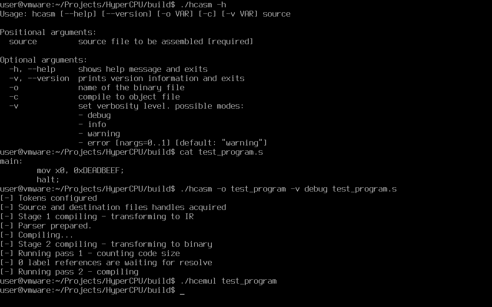

<div align="center">
     <picture>
          <source media="(prefers-color-scheme: dark)" srcset="images/logo_dark.png">
          <source media="(prefers-color-scheme: light)" srcset="images/logo.png">
          
     </picture>
</div>

<h4 align="center">HyperCPU — the <i>hyper</i> toolkit for custom <i>hyper</i> ISA</h4>

<p align="center">
     <a href="https://github.com/HyperWinX/HyperCPU/issues">
     </a>
     
     
     
     
     
</p>

>[!IMPORTANT]
> HyperCPU is almost ready for use! Wait for 1.0 release to try it out or build the project yourself, test it and report issues.



### What is this

HyperCPU is a set of programs created to work with my own simple ISA (instruction set architecture). The project was created for fun, but it took a lot of time (and nerves), and I learned a lot while working on it.

HyperCPU project includes:
* **hCPU emulator** (aka `hcemul`);
* **hASM assembler** (aka `hcasm`);
* ~~**hASM disassembler**~~ (planned).

See [ROADMAP.md](ROADMAP.md) for project ideas and tasks.

### Installation

>[!WARNING]
> HyperCPU supports 64-bit GNU/Linux systems only. It is known to be successfully built and running on `amd64` and `aarch64` architectures.
>
> HyperCPU fails to build and/or work properly under \*BSD systems ­— please do not ask us for support of these systems. Windows support is also not planned.

#### Binaries

Pre-compiled binaries are currently not available. Sorry.

#### Building from sources

Building HyperCPU requires these dependencies to be installed:

* **C++20 compilers:** GCC 12+, Clang 14+.
* **Build systems:** CMake 3.25+, Ninja, GNU make.
* **Libraries:** re2, fmt (development files, of course).

Building the tests requires googletest (gtest) to be installed. Generating the documentation in HTML format requires Python 3 and a few modules (`python3-pip`, `python3-sphinx`, `python3-sphinx-rtd-theme`) to be installed.

After installing dependencies run these commands in the terminal:

```bash
$ git clone --recursive https://github.com/HyperWinX/HyperCPU
$ cd HyperCPU
$ cmake -S . -B build -DCMAKE_BUILD_TYPE=Release
$ make -C build default -j$(nproc)
```

Build process can be tweaked by defining various build options (`cmake ... -DBUILD_OPTION=VALUE ...`):

* `CMAKE_BUILD_TYPE:STRING` — project build profile (`Release`, `RelWithDebInfo` or `Debug`). Mandatory to be specified.
* `HCPU_COMPILER:STRING` allows to select a compiler that will be used to build the project. Supported values:
    * `auto` — let CMake automatically detect a needed compiler or use compiler paths defined by user.
    * `clang` — use Clang, search for `clang` and `clang++` binaries. Hinting is supported, so if your `clang` binary is called `clang-19`, you can pass: `-DHCPU_COMPILER=clang -DCMAKE_C_COMPILER=clang-19 -DCMAKE_CXX_COMPILER=clang++-19`.
    * `gcc` — use GCC, search for `gcc` and `g++` binaries. Be careful: in some environments Clang can do `gcc --> clang` symlinks. You can hint the binary name the same way as with `clang` mode: `-DHCPU_COMPILER=gcc -DCMAKE_C_COMPILER=gcc-14 -DCMAKE_CXX_COMPILER=g++-14`.
* `HCPU_LTO:BOOL` — enable building with LTO. If Clang is used, CMake will search for LLD. If LLD is found, LTO will be enabled, otherwise not. If using GCC, there are no dependencies.
* `HCPU_MARCH_NATIVE:BOOL` — use native architecture (`-march=native`).
* `HCPU_SANITIZERS:BOOL` — use ASan and LSan sanitizers. Enabled by default — set to `OFF` to disable.

The compiled binaries should be located in `build` directory, and the generated documentation should be located in `docs/_build/html` directory. After building the project open `index.html` file and start reading the documentation.

Do not forget to check out [examples](examples) folder for interesting code examples that will help you better understand the syntax of hASM and the power of HyperCPU.

### Usage

#### `hcasm` (hASM assembler)

```bash
$ ./hcasm [-h] [--help] [--version] [-o VAR] [-c] [-v VAR] source
```

* `source` — source code file to be compiled.
* `-h`, `--help` — display help message and exit.
* `--version` — display program version and exit.
* `-o VAR` — specify output binary file name.
* `-c` — generate an object file.
* `-v VAR` — specify verbosity level (`debug`, `info`, `warning`, `error`). Default value is `warning`.

#### `hcemul` (hCPU emulator)

```bash
$ ./hcemul [-h] [--help] [--version] [-v VAR] [-m VAR] [--memory VAR] binary
```

* `binary` — binary file to be executed.
* `-h`, `--help` — display help message and exit.
* `--version` — display program version and exit.
* `-v VAR` — specify verbosity level (`debug`, `info`, `warning`, `error`). Default value is `warning`.
* `-m`, `--memory` — specify max. memory amount to be used. Postfixes are supported. Default value is `8K`.

### Contributing

HyperCPU is in active development and we will be happy to hear any feedback from you. Do not hesitate to report bugs or suggest any ideas using "Issues" page.

Wanna contribute to the project? Read [CONTRIBUTION.md](CONTRIBUTION.md) firstly.

Thank you for your interest in HyperCPU.

### Authors

* **[HyperWin](https://github.com/HyperWinX) (2024 - present time)**\
  *HyperCPU Founder and Lead Developer, Documentation Author*

* **[Ivan Movchan](https://github.com/ivan-movchan) (2025 - present time)**\
  *Beta Tester, Developer and Artist*

### License

HyperCPU is free software: you can redistribute it and/or modify it under the terms of the GNU General Public License as published by the Free Software Foundation, either version 3 of the License, or (at your option) any later version.

This program is distributed in the hope that it will be useful, but WITHOUT ANY WARRANTY; without even the implied warranty of MERCHANTABILITY or FITNESS FOR A PARTICULAR PURPOSE. See the GNU General Public License for more details.

You should have received a copy of the GNU General Public License along with this program. If not, see <http://www.gnu.org/licenses/>.
